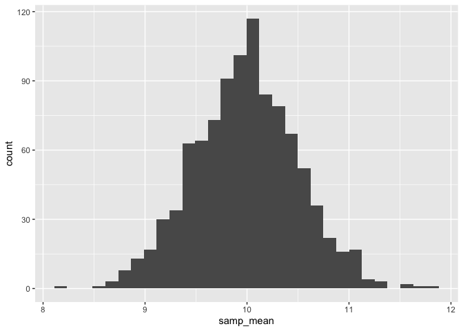

Simulations
================

## Writing a simulation function

``` r
sim_mean_sd = function(samp_size, true_mean = 10, true_sd = 5) {
  
  sim_df = 
    tibble(
      x = rnorm(samp_size, true_mean, true_sd)
    )

  out_df =
    sim_df |> 
    summarize(
      samp_mean = mean(x),
      samp_sd = sd(x)
    )
  
  return(out_df)

}
```

Run this a lot of times…

``` r
sim_mean_sd(30)
```

    ## # A tibble: 1 × 2
    ##   samp_mean samp_sd
    ##       <dbl>   <dbl>
    ## 1      10.4    4.62

Run this using a for loop?

``` r
output = vector("list", 1000)

for (i in 1:1000) {
  output[[i]] = sim_mean_sd(30)
}

bind_rows(output) |> 
  summarize(
    ave_samp_mean = mean(samp_mean),
    se_sample_mean = sd(samp_mean)
  )
```

    ## # A tibble: 1 × 2
    ##   ave_samp_mean se_sample_mean
    ##           <dbl>          <dbl>
    ## 1          9.99          0.870

Can I use map instead?

``` r
sim_res = 
  tibble(
    iter = 1:1000
  ) |> 
  mutate(samp_res = map(iter, sim_mean_sd, samp_size = 30)) |> 
  unnest(samp_res)
```

Could I try different sample sizes?

``` r
sim_res = 
  expand_grid( # creates all possible combinations of n and 1000 iterations
    n = c(10, 30, 60, 100),
    iter = 1:1000
  ) |> 
  mutate(samp_res = map(n, sim_mean_sd)) |> 
  unnest(samp_res)
```

``` r
sim_res |> 
  group_by(n) |> 
  summarize(se = sd(samp_mean))
```

    ## # A tibble: 4 × 2
    ##       n    se
    ##   <dbl> <dbl>
    ## 1    10 1.55 
    ## 2    30 0.914
    ## 3    60 0.642
    ## 4   100 0.510

``` r
sim_res |> 
  filter(n == 100) |> 
  ggplot(aes(x = samp_mean)) +
  geom_histogram()
```

    ## `stat_bin()` using `bins = 30`. Pick better value with `binwidth`.

<!-- -->

``` r
sim_data = 
  tibble(
    x = rnorm(30, mean = 1, sd = 1),
    y = 2 + 3*x + rnorm(30, 0, 1)
  )

lm_ft = lm(y ~ x, data = sim_data)

sim_data |> 
  ggplot(aes(x = x, y = y)) +
  geom_point() +
  stat_smooth(method = "lm")
```

    ## `geom_smooth()` using formula = 'y ~ x'

<!-- -->

Turn this into a function.

``` r
sim_regression = function(n) {
  
  sim_data = 
    tibble(
      x = rnorm(n, mean = 1, sd = 1),
      y = 2 + 3*x + rnorm(n, 0, 1)
    )

  lm_fit = lm(y ~ x, data = sim_data)
  
  out_df = 
    tibble(
      beta0_hat = coef(lm_fit)[1], # coefficient
      beta1_hat = coef(lm_fit)[2] # slope
    )
  
  return(out_df)
}
```

``` r
sim_res = 
  expand_grid(
    sample_size = c(30, 60),
    iter = 1:1000
  ) |> 
  mutate(lm_res = map(sample_size, sim_regression)) |> 
  unnest(lm_res)

sim_res |> 
  mutate(sample_size = str_c("n = ", sample_size)) |> 
  ggplot(aes(x = sample_size, y = beta1_hat)) +
  geom_boxplot()
```

<!-- -->

## Birthday problem

Let’s put people in a room.

``` r
bday_sim = function(n) {
  
  bdays = sample(1:365, size = n, replace = TRUE)
  
  duplicate = length(unique(bdays)) < n
  
  return(duplicate)
}

bday_sim(10)
```

    ## [1] FALSE

Run this a lot.

``` r
sim_res = 
  expand_grid(
    n = 2:50,
    iter = 1:10000
  ) |> 
  mutate(res = map_lgl(n, bday_sim)) |> 
  group_by(n) |> 
  summarize(prob = mean(res))

sim_res |> 
  ggplot(aes(x = n, y = prob)) +
  geom_line()
```

<!-- -->
